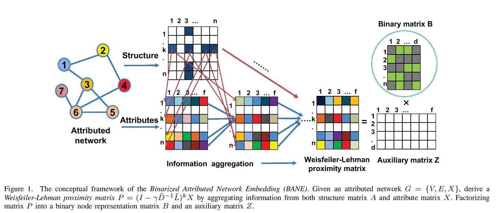

BANE
============================================
<p align="justify">
An implementation of "Binarized Attributed Network Embedding". Attributed network embedding enables joint representation learning of node links and attributes. Existing attributed network embedding models are designed in continuous Euclidean spaces which often introduce data redundancy and impose challenges to storage and computation costs. To this end, we present a Binarized Attributed Network Embedding model (BANE for short) to learn binary node representation. Specifically, we define a new Weisfeiler-Lehman proximity matrix to capture data dependence between node links and attributes by aggregating the information of node attributes and links from neighboring nodes to a given target node in a layer-wise manner. Based on the Weisfeiler-Lehman proximity matrix, we formulate a new Weisfiler-Lehman matrix factorization learning function under the binary node representation constraint. The learning problem is a mixed integer optimization and an efficient cyclic coordinate descent (CCD) algorithm is used as the solution. Node classification and link prediction experiments on real-world datasets show that the proposed BANE model outperforms the state-of-the-art network embedding methods.
</p>
<div style="text-align:center"></div>

This repository provides an implementation for FSCNMF as described in the paper:
> FSCNMF: Fusing Structure and Content via Non-negative Matrix Factorization for Embedding Information Networks.
> Sambaran Bandyopadhyay, Harsh Kara, Aswin Kannan and M N Murty
> arXiv, 2018.
>https://arxiv.org/pdf/1804.05313.pdf


### Requirements

The codebase is implemented in Python 3.5.2. package versions used for development are just below.
```
networkx          1.11
tqdm              4.28.1
numpy             1.15.4
pandas            0.23.4
texttable         1.5.0
scipy             1.1.0
argparse          1.1.0
```
### Datasets

The code takes an input graph in a csv file. Every row indicates an edge between two nodes separated by a comma. The first row is a header. Nodes should be indexed starting with 0. Sample graphs for the `Wikipedia Chameleons` and `Wikipedia Giraffes` are included in the  `input/` directory. 

The feature matrix can be stored two ways:

If the feature matrix is a **sparse binary** one it is stored as a json. Nodes are keys of the json and features are the values. For each node feature column ids are stored as elements of a list. The feature matrix is structured as:

```javascript
{ 0: [0, 1, 38, 1968, 2000, 52727],
  1: [10000, 20, 3],
  2: [],
  ...
  n: [2018, 10000]}
```
If the feature matrix is **dense** it is assumed that it is stored as csv with comma separators. It has a header, the first column contains node identifiers and it is sorted by these identifers. It should look like this:

| **NODE ID**| **Feature 1** | **Feature 2** | **Feature 3** | **Feature 4** |
| --- | --- | --- | --- |--- |
| 0 | 3 |0 |1.37 |1 |
| 1 | 1 |1 |2.54 |-11 |
| 2 | 2 |0 |1.08 |-12 |
| 3 | 1 |1 |1.22 |-4 |
| ... | ... |... |... |... |
| n | 5 |0 |2.47 |21 |


### Options

Learning of the embedding is handled by the `src/main.py` script which provides the following command line arguments.

#### Input and output options

```
  --edge-path    STR        Input graph path.           Default is `input/chameleon_edges.csv`.
  --feature-path STR        Input Features path.        Default is `input/chameleon_features.json`.
  --output-path  STR        Embedding path.             Default is `output/chameleon_fscnmf.csv`.
```

#### Model options

```
  --features       STR         Structure of the feature matrix.                   Default is `sparse`. 
  --dimensions     INT         Number of embeding dimensions.                     Default is 32.
  --order          INT         Order of adjacency matrix powers.                  Default is 3.
  --iterations     INT         Number of power interations.                       Default is 500.
  --alpha_1        FLOAT       Alignment parameter for adjacency matrix.          Default is 1000.0.
  --alpha_2        FLOAT       Adjacency basis regularization.                    Default is 1.0.
  --alpha_3        FLOAT       Adjacency features regularization.                 Default is 1.0.
  --beta_1         FLOAT       Alignment parameter for feature matrix.            Default is 1000.0.
  --beta_2         FLOAT       Attribute basis regularization .                   Default is 1.0.
  --beta_3         FLOAT       Attribute feature regularization.                  Default is 1.0.
  --gamma          FLOAT       Embedding mixing parameter.                        Default is 0.5.  
  --lower-control  FLOAT       Overflow control parameter.                        Default is 10**-15.  
```

### Examples

The following commands learn a graph embedding and write the embedding to disk. The node representations are ordered by the ID.

Creating aN FSCNMF embedding of the default dataset with the default hyperparameter settings. Saving the embedding at the default path.

```
python src/main.py
```
Creating an FSCNMF embedding of the default dataset with 128 dimensions and approximation order 1.

```
python src/main.py --dimensions 128 --order 1
```

Creating an FSCNMF embedding of the default dataset with asymmetric mixing.

```
python src/main.py --gamma 0.1
```

Creating an embedding of an other dense structured dataset the `Wikipedia Giraffes`. Saving the output in a custom folder.

```
python src/main.py --edge-path input/giraffe_edges.csv --feature-path input/giraffe_features.csv --output-path output/giraffe_fscnmf.csv --features dense
```
